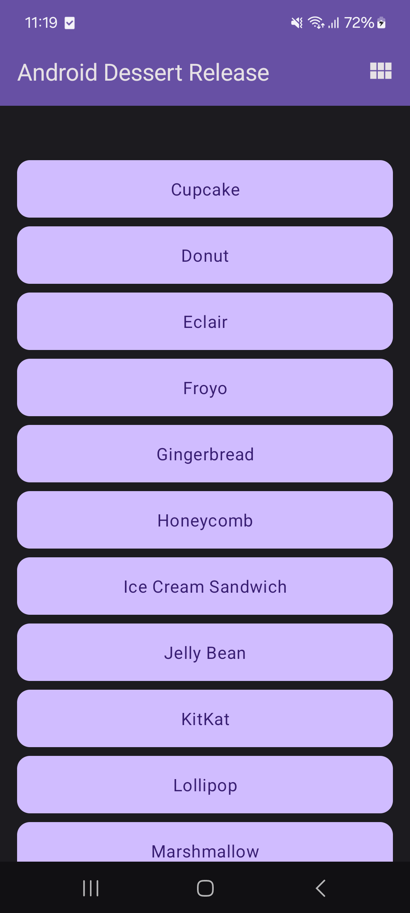
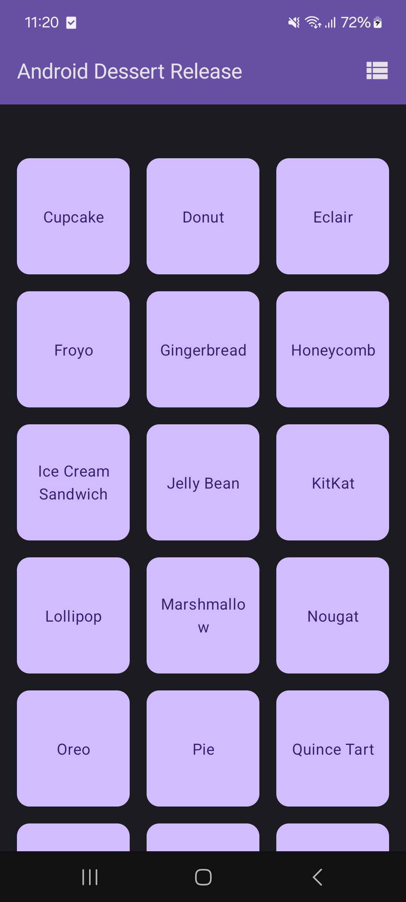

<h1 align="center" >  Dessert Release App  <br> [ ᴀɴᴅʀᴏɪᴅ ♾ ᴅᴇᴍᴏ ᴘʀᴏᴊᴇᴄᴛ ]</h1>

## ɪ  ⁃  ᴘʀᴏᴊᴇᴄᴛ ɪɴꜰᴏ

The Dessert Release app is a simple app which displays a collection of Android dessert releases. This app is used to teach the concept of Preferences DataStore.
<br>

<div align="center">

⁃ ᴄᴏɴᴛᴇɴᴛꜱ ⁃  
[ᴜꜱᴇʀ ꜰᴇᴀᴛᴜʀᴇꜱ](#ɪɪ--ᴡʜᴀᴛ-ᴜꜱᴇʀꜱ-ᴄᴀɴ-ᴇxᴘᴇᴄᴛ)
| [ᴀᴘᴘ ꜱᴄʀᴇᴇɴꜱ](#ɪɪɪ--ᴠɪꜱᴜᴀʟ-ᴛᴏᴜʀ-ᴏꜰ-ᴛʜᴇ-ᴀᴘᴘ-ꜱᴄʀᴇᴇɴꜱ)
| [ᴘʀᴏᴊᴇᴄᴛ ʙʀᴀɴᴄʜᴇꜱ](#ɪᴠ--ᴘʀᴏᴊᴇᴄᴛ-ʙʀᴀɴᴄʜᴇꜱ)
| [ᴅᴇᴠ ꜰᴇᴀᴛᴜʀᴇꜱ](#ᴠ--ʙᴇʜɪɴᴅ-ᴛʜᴇ-ᴄᴏᴅᴇ-ᴅᴇᴠ-ꜰᴇᴀᴛᴜʀᴇꜱ)
| [ᴘʀᴏᴊᴇᴄᴛ ɴᴏᴛᴇꜱ](#ᴠɪ--ᴘʀᴏᴊᴇᴄᴛ-ɴᴏᴛᴇꜱ)

<br>
<br>

[](#)
[](#)

[](#)
[](#)
[](#)
[](#)

<br>
<br>


<br>

</div>


## ɪɪ ⁃ ᴡʜᴀᴛ ᴜꜱᴇʀꜱ ᴄᴀɴ ᴇxᴘᴇᴄᴛ

### ⭓ Features


1. Add Items
    - Users can add new inventory items to the local database.
    - The form may include fields like item name, quantity, price, description, etc.


##
### ⭓ Requirements
- Android 7.0 and Above
- Min SDK version 24


##
### ⭓ Permissions
- N/A

<hr>

## ɪɪɪ ⁃ ᴠɪꜱᴜᴀʟ ᴛᴏᴜʀ ᴏꜰ ᴛʜᴇ ᴀᴘᴘ: ꜱᴄʀᴇᴇɴꜱ

<p align="center">


</p>


#
<div align="center">


  <br>

<kbd>[&nbsp; ⮝ &nbsp;  BACK TO TOP  &nbsp;&nbsp;&nbsp;](#ɪ----ᴘʀᴏᴊᴇᴄᴛ-ɪɴꜰᴏ) </kbd>
</div>


#
## ɪᴠ ⁃ ᴘʀᴏᴊᴇᴄᴛ ʙʀᴀɴᴄʜᴇꜱ

<!-- Main / Master / Production Branch -->

> <samp> **PRODUCTION BRANCH :**  </samp>  
> Stable code for deployment  
> ➲ [main][branch-main]

> <samp> **STAGING BRANCH :**  </samp>  
> `FLOW | Staging → Production`  
> For pre-release testing, which ensures that the code is stable, bug-free, and ready for deployment.  
> ➲ [staging][branch-staging]

> <samp> **DEVELOPMENT BRANCH :**  </samp>  
> `FLOW | Development → Release → Staging → Production`  
> Active codebase for ongoing development efforts  (New features, bug fixes, and improvements..)  
> ➲ [development][branch-development]


> <samp> **FEATURE BRANCHES :** N/A  </samp>  
> `FLOW | Feature → Development → Release → Staging → Production`  
<!-- 
> <samp> **FEATURE BRANCHES :**  </samp>  
> For Isolated feature development (Ensures changes are tested and reviewed before merging into the main workflow)  
>   
> feature/  
> ➲ dark-theme  
> ➲ offline-db-impl
-->


> <samp> **RELEASE BRANCHES :** N/A  </samp>  
> `FLOW | Release → Staging → Production`  
<!-- 
> <samp> **RELEASE BRANCHES :**  </samp>  
> Prepares the code for final testing and deployment in a new version release.
>   
> release/  
> ➲ version-number
-->


> <samp> **HOTFIX BRANCHES :** N/A  </samp>  
> `FLOW | Hotfix → Staging → Production`  
<!-- 
> <samp> **HOTFIX BRANCHES :**  </samp>  
> Handles critical fixes in production that need immediate resolution.
>   
> hotfix/  
> ➲ main-screen-crash 
-->


> <samp> **BUGFIX BRANCHES :** N/A  </samp>  
> `FLOW | Bugfix → Development → Release → Staging → Production` 
<!-- 
> <samp> **BUGFIX BRANCHES :**  </samp>  
> Addresses specific bugs identified during development and testing.
>   
> bugfix/  
> ➲ main-screen-error
-->

<!-- 
> <samp> **EXPERIMENTAL BRANCHES :** N/A  </samp>  

> <samp> **EXPERIMENTAL BRANCHES :**  </samp>  
> Facilitates trial and error to test new ideas and concepts.
>   
> experiment/  
> ➲ main-screen-change-colours
-->
<!-- Experimental → Feature → Development → Release → Staging → Main/Production   -->


[branch-main]:  https://github.com/dizzcode/inventory-android-test-app/tree/main
[branch-development]:  https://github.com/dizzcode/inventory-android-test-app/tree/development
[branch-staging]:  https://github.com/dizzcode/inventory-android-test-app/tree/staging

[branch-feature-NAME]:  https://github.com/dizzcode/inventory-android-test-app/tree/staging

[branch-hotfix-NAME]:  https://github.com/dizzcode/inventory-android-test-app/tree/staging

[branch-bugfix-NAME]:  https://github.com/dizzcode/inventory-android-test-app/tree/staging

<br>  


#
## ᴠ ⁃ ʙᴇʜɪɴᴅ ᴛʜᴇ ᴄᴏᴅᴇ: ᴅᴇᴠ ꜰᴇᴀᴛᴜʀᴇꜱ

### ⭓ App Dependencies/Libraries Overview

<br>

* [Kotlin][0] : Kotlin is statically typed & first-class language for Android Development.
* [Coroutines][1] : For Asynchronus or non-blocking operations.
* [Flows][2] : Data Streaming API which is built on top of Coroutines.
* [Jetpack Compose][3] : Toolkit for building native UI in a declarative way.
* [Room][4] : Save data in a local database using Room
* [Retrofit][5] : Type-safe REST client for Android to consume RESTful web services.
* [Dagger Hilt][6] : Dependency injection library for Android.
* [Kotlin DSL][7] : For writing gradle script for Kotlin is more readable and offers better compile-time.

[0]:  https://kotlinlang.org/
[1]:  https://kotlinlang.org/docs/coroutines-overview.html
[2]:  https://developer.android.com/kotlin/flow
[3]:  https://developer.android.com/jetpack/compose
[4]:  https://developer.android.com/training/data-storage/room
[5]:  https://github.com/square/retrofit
[6]:  https://dagger.dev/hilt/
[7]:  https://docs.gradle.org/current/userguide/kotlin_dsl.html


#
### ⭓ Features

1. DataStore &nbsp;|&nbsp;  [ More-> ](#1-datastore)  


<br>
<br>  
<br>  

#
<div align="center">

<kbd>[&nbsp; ⮝ &nbsp;  BACK TO TOP  &nbsp;&nbsp;&nbsp;](#ɪ----ᴘʀᴏᴊᴇᴄᴛ-ɪɴꜰᴏ) </kbd>
</div>

#
# ᴠɪ ⁃ ᴘʀᴏᴊᴇᴄᴛ ɴᴏᴛᴇꜱ

<br> 

____

## 1. DataStore

<br>  

#
### 1.1 How to add DataStore library to the app

Set up dependencies | inside `build.gradle.kts` (Module :app)

```kotlin
//DataStore
implementation("androidx.datastore:datastore-preferences:1.0.0")
```

<br>  

#
### 1.2 Implement the user preferences repository

- In the `data` package, create a new class called `UserPreferencesRepository.kt`
- In the `UserPreferencesRepository` constructor, define a private value property to represent a `DataStore` object instance with a `Preferences` type.

```kotlin
class UserPreferencesRepository(
    private val dataStore: DataStore<Preferences>
){
}
```

#
> [!IMPORTANT]  
> Make sure to use the `androidx.datastore.preferences.core.Preferences` import for the Preferences class.
> #
> DataStore stores key-value pairs. To access a value you must define a key.
> #

<br>

- Create a `companion object` inside the UserPreferencesRepository class.
- Use the `booleanPreferencesKey()` function to define a key and pass it the name is_linear_layout. 
  - Similar to SQL table names, the key needs to use an underscore format. 
  - This key is used to access a boolean value indicating whether the linear layout should be shown.

```kotlin
class UserPreferencesRepository(
    private val dataStore: DataStore<Preferences>
){
    private companion object {
        val IS_LINEAR_LAYOUT = booleanPreferencesKey("is_linear_layout")
    }
    // ...
}
```

<br>  

#
### 1.3 Write to the DataStore

- You create and modify the values within a DataStore by passing a lambda to the `edit()` method.
The lambda is passed an instance of MutablePreferences, which you can use to update values in the DataStore.
- All the updates inside this lambda are executed as a single transaction.
  - Put another way, the update is atomic - it happens all at one time. This type of update prevents a situation in which some values update but others do not. 

<br>

- Create a suspend function and call it saveLayoutPreference().

- In the saveLayoutPreference() function, call the edit() method on the dataStore object.

- To make your code more readable, define a name for the MutablePreferences provided in the lambda body. Use that property to set a value with the key you defined and the boolean passed to the saveLayoutPreference() function.

```kotlin
suspend fun saveLayoutPreference(isLinearLayout: Boolean) {
    dataStore.edit { preferences ->
        preferences[IS_LINEAR_LAYOUT] = isLinearLayout
    }
}
```

#
> [!IMPORTANT]  
> #
> The value does not exist in DataStore until this function is called and the value is set.  
> By setting up the key-value pair in the edit() method,  
> the value is defined and initialized until the app's cache or data is cleared.
> #


<br>  

#
### 1.4 Read from the DataStore

Now that you have created a way to write isLinearLayout into dataStore, take the following steps to read it:

- Create a property in UserPreferencesRepository of type Flow<Boolean> called isLinearLayout.
- You can use the DataStore.data property to expose DataStore values. Set isLinearLayout to the data property of the DataStore object.
- Use the map function to convert the Flow<Preferences> into a Flow<Boolean>.
- Specify true to default to the linear layout view.
- 
```kotlin
val isLinearLayout: Flow<Boolean> = dataStore.data.map { preferences ->
    preferences[IS_LINEAR_LAYOUT] ?: true
}
```

#
> [!NOTE]
> #
>  The Preferences object contains all the key-value pairs in the DataStore.  
> Each time the data in the DataStore is updated, a new Preferences object is emitted into the Flow.
> #
> Remember that until the preference is defined and initialized, it does not exist in the DataStore.  
> That is why you must programmatically confirm that the preference exists and provide a default value if it does not.
> #

<br>  

#
### 1.5 Exception handling

File system interactions can fail, such as missing files or full/unmounted disks. DataStore read/write operations may trigger IOExceptions. Use the catch{} operator to handle these failures

- In the companion object, implement an immutable TAG string property to use for logging.

```kotlin
suspend fun saveLayoutPreference(isLinearLayout: Boolean) {
    dataStore.edit { preferences ->
        preferences[IS_LINEAR_LAYOUT] = isLinearLayout
        const val TAG = "UserPreferencesRepo" //Added
    }
}
```

<br>

- Preferences DataStore throws an IOException when an error is encountered while reading data. In the isLinearLayout initialization block, before map(), use the catch{}operator to catch the IOException.

```kotlin
val isLinearLayout: Flow<Boolean> = dataStore.data
    .catch {} //Added
    .map { preferences ->
        preferences[IS_LINEAR_LAYOUT] ?: true
    }
```
<br>

- In the catch block, if there is an IOexception, log the error and emit emptyPreferences(). If a different type of exception is thrown, prefer re-throwing that exception. By emitting emptyPreferences() if there is an error, the map function can still map to the default value.

```kotlin
val isLinearLayout: Flow<Boolean> = dataStore.data
    .catch { // -------------- Added
        if(it is IOException) {
            Log.e(TAG, "Error reading preferences.", it)
            emit(emptyPreferences())
        } else {
            throw it
        }
    } // -------------- Added
    .map { preferences ->
        preferences[IS_LINEAR_LAYOUT] ?: true
    }
```
[ View Full Code --> ](./app/src/main/java/dizzcode/com/dessertrelease/data/local/UserPreferencesRepository.kt)

<br>  

#
### 1.6 Initialize the DataStore

In this project, you must handle the dependency injection manually.  
Therefore, you must manually provide the UserPreferencesRepository class with a Preferences DataStore.  
Follow these steps to inject DataStore into the UserPreferencesRepository.

- Find the dessertrelease package.


- Within this directory, create a new class called DessertReleaseApplication and implement the Application class. This is the container for your DataStore.

```kotlin
class DessertReleaseApplication: Application() {
}
```

- In DessertReleaseApplication.kt, declare a private const val LAYOUT_PREFERENCE_NAME outside the class and set its value to "layout_preferences" for use in the Preferences Datastore.


- In DessertReleaseApplication.kt, outside the DessertReleaseApplication class, create a private DataStore<Preferences> property called Context.dataStore using the preferencesDataStore delegate, and pass LAYOUT_PREFERENCE_NAME as the name parameter.

```kotlin
//Added
private const val LAYOUT_PREFERENCE_NAME = "layout_preferences"
private val Context.dataStore: DataStore<Preferences> by preferencesDataStore(
    name = LAYOUT_PREFERENCE_NAME
)

class DessertReleaseApplication : Application() {
}
```

- Inside the DessertReleaseApplication class body, create a lateinit var instance of the UserPreferencesRepository.
- Override the onCreate() method.
- Inside the onCreate() method, initialize userPreferencesRepository by constructing a UserPreferencesRepository with dataStore as its parameter.


```kotlin
private const val LAYOUT_PREFERENCE_NAME = "layout_preferences"

private val Context.dataStore: DataStore<Preferences> by preferencesDataStore(
    name = LAYOUT_PREFERENCE_NAME
)

class DessertReleaseApplication : Application() {
    lateinit var userPreferencesRepository: UserPreferencesRepository

    override fun onCreate() {
        super.onCreate()
        userPreferencesRepository = UserPreferencesRepository(dataStore)
    }
}
```
[ View Full Code --> ](./app/src/main/java/dizzcode/com/dessertrelease/DessertReleaseApplication.kt)


- Add the following line inside the <application> tag in the AndroidManifest.xml file.

```xml
<application
android:name=".DessertReleaseApplication"

</application>
```


<br>  

#
### 1.7 Use the UserPreferencesRepository

Provide the repository to the ViewModel

- Now that the UserPreferencesRepository is available through dependency injection, you can use it in DessertReleaseViewModel.
- In the DessertReleaseViewModel, create a UserPreferencesRepository property as a constructor parameter.
- 

```kotlin
class DessertReleaseViewModel(
    private val userPreferencesRepository: UserPreferencesRepository
) : ViewModel() {
    // ...
}
```
[ View Full Code --> ](./app/src/main/java/dizzcode/com/dessertrelease/ui/DessertReleaseViewModel.kt)

<br>

- Within the ViewModel's companion object, in the viewModelFactory initializer block, obtain an instance of the DessertReleaseApplication using the following code.
- Create an instance of the DessertReleaseViewModel and pass the userPreferencesRepository.

```kotlin
companion object {
    val Factory: ViewModelProvider.Factory = viewModelFactory {
        initializer {
            val application = (this[APPLICATION_KEY] as DessertReleaseApplication)
            DessertReleaseViewModel(application.userPreferencesRepository)
        }
    }
}
```
[ View Full Code --> ](./app/src/main/java/dizzcode/com/dessertrelease/ui/DessertReleaseViewModel.kt)

- The UserPreferencesRepository is now accessible by the ViewModel.

<br>  

#
### 1.8 Store the layout preference

- Edit selectLayout() in DessertReleaseViewModel to access the preferences repository and update the layout preference. Start a coroutine to call the saveLayoutPreference() function asynchronously.

```kotlin
fun selectLayout(isLinearLayout: Boolean) {
    viewModelScope.launch {
        userPreferencesRepository.saveLayoutPreference(isLinearLayout)
    }
}
```
[ View Full Code --> ](./app/src/main/java/dizzcode/com/dessertrelease/ui/DessertReleaseViewModel.kt)

<br>  

#
### 1.9 Read the layout preference

Refactor uiState: StateFlow in the ViewModel to reflect the isLinearLayout: Flow from the repository.

- Delete the uiState initialization with MutableStateFlow(DessertReleaseUiState).

- Use the map() function on the isLinearLayout Flow to convert it into a UI state.

- Return a DessertReleaseUiState instance with the isLinearLayout Boolean to update the UI.

Since isLinearLayout is a cold Flow, convert it to a hot StateFlow using stateIn().   
Pass viewModelScope, SharingStarted.WhileSubscribed(5_000), and DessertReleaseUiState() as parameters to stateIn().

> Initial Code
```kotlin
val uiState: StateFlow<DessertReleaseUiState> = _uiState
```

<br>

> Modified Code
```kotlin
val uiState: StateFlow<DessertReleaseUiState> =
    userPreferencesRepository.isLinearLayout.map { isLinearLayout ->
        DessertReleaseUiState(isLinearLayout)
    }
        .stateIn(
            scope = viewModelScope,
            started = SharingStarted.WhileSubscribed(5_000),
            initialValue = DessertReleaseUiState()
        )
```
[ View Full Code --> ](./app/src/main/java/dizzcode/com/dessertrelease/ui/DessertReleaseViewModel.kt)

#
### Try toggling the layout and closing the app. Reopen the app and notice that your layout preference was saved.
#
<br>

#

<kbd>[&nbsp; ► &nbsp;  BACK TO Project Notes  &nbsp;&nbsp;&nbsp;](#ᴠɪ--ᴘʀᴏᴊᴇᴄᴛ-ɴᴏᴛᴇꜱ) </kbd>

____


<br>

<hr>
<div align="center">

<kbd>[&nbsp; ⮝ &nbsp;  BACK TO TOP  &nbsp;&nbsp;&nbsp;](#ɪ----ᴘʀᴏᴊᴇᴄᴛ-ɪɴꜰᴏ) </kbd>
</div>
<hr>
<br>
